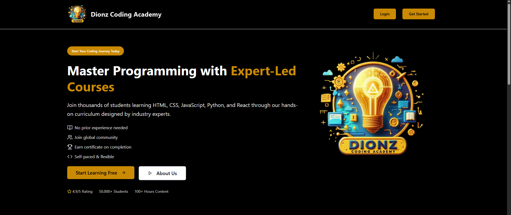
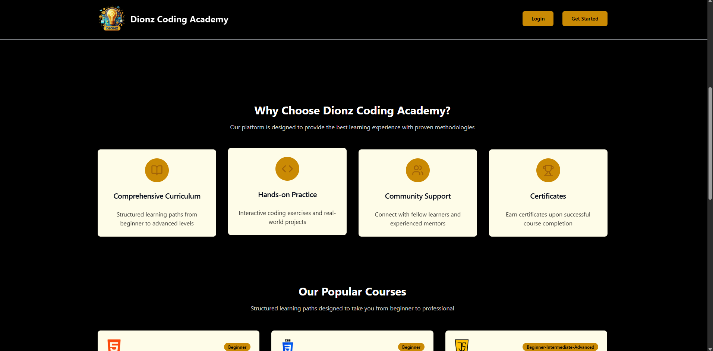
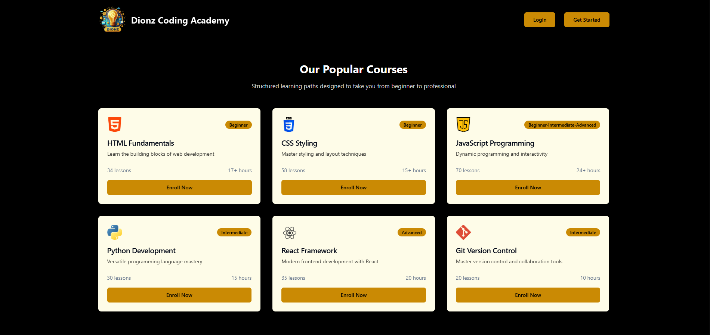
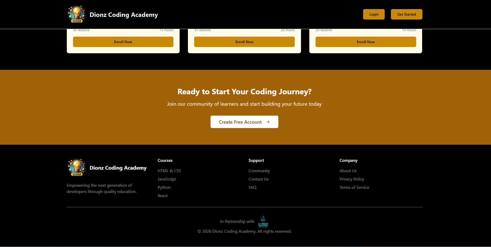
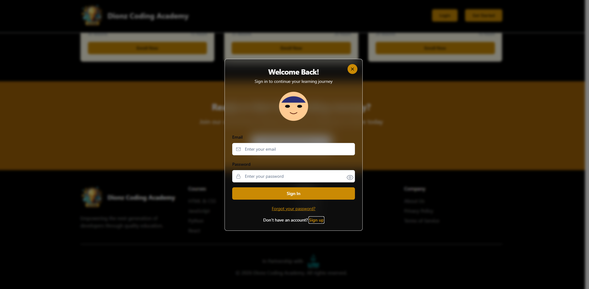
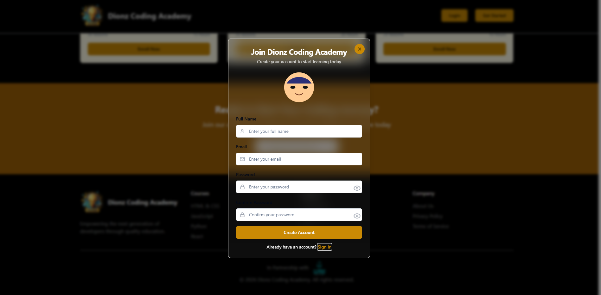
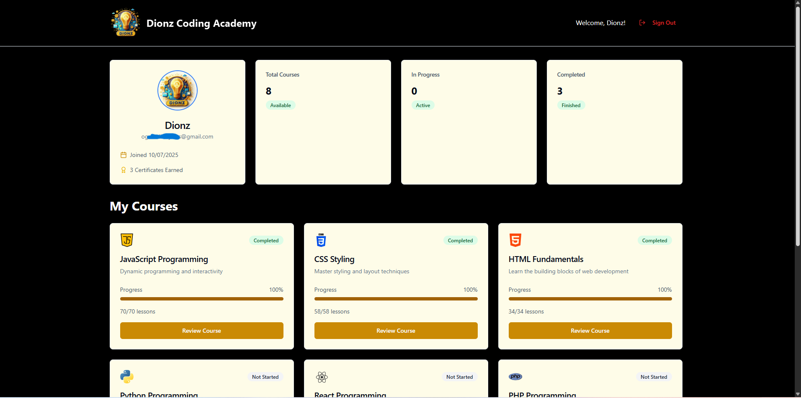
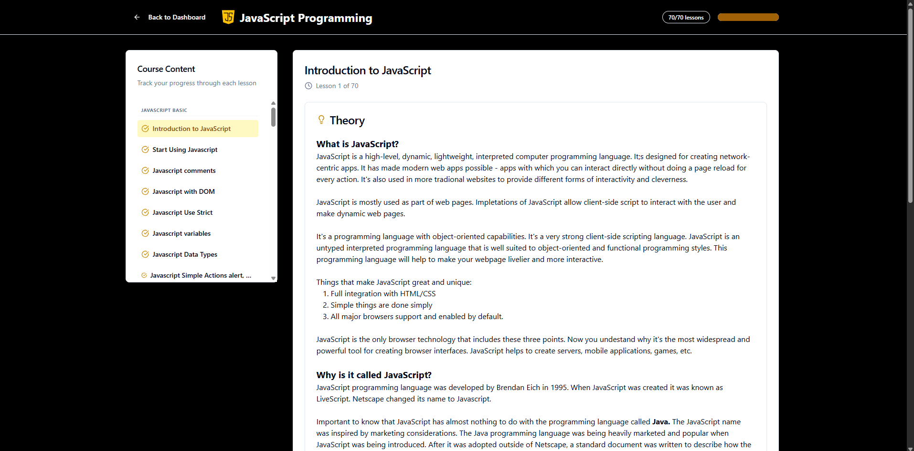

# Dionz Coding Academy

<p align="center">
 
</p>

## Project Gallery

### The Experience (Landing Page)
I designed the landing page to be clean and inviting. Here is a walkthrough of the main sections:

<p align="center">
  
  
  
</p>

### User Journey (Auth & Access)
Security is a priority. I used **supabase Auth** to handle the student onboarding process

<p align="center">
  
  
</p>

### The Learning Hub
Once logged in, students can access their personalized dashboard and dive into specific coding courses.

<p align="center">
  
</p>

<p align="center">
  
</p>

A modern learning platform designed to streamline the journey for aspiring developers. This application provides a seamless interface for students to access coding resources, track their progress, and engage with the curriculum.

## My Philosophy
At **Dionz Coding Academy**, I believe that learning to code should be as dynamic as the technology itself. This platform isn't just a repository of tutorials; it's a launchpad I designed for the next generation of digital builders.

The core of this project is built on three pillars:

* **Practical Mastery:** I focus on moving beyond syntax. The curriculum is designed around building real-world projects so learners understand the *why* behind the code.
* **Modern Standards:** By utilizing a cutting-edge stack—including **Vite**, **TypeScript**, and **Tailwind CSS**—I immerse students in the exact tools used by top-tier engineering teams today.
* **Accessible Excellence:** I believe high-quality coding education should be seamless. Using **shadcn-ui**, I’ve removed the friction between the learner and the logic.

## Features
* **User Authentication:** Secure login and registration via Supabase.
* **Course Catalog:** Browsable list of coding tracks.
* **Responsive Design:** Optimized for all devices using Tailwind CSS.
* **Interactive UI:** High-quality components built with shadcn-ui.
## Tech stack
* **Frontend:** React with Vite (for lightning-fast builds).
* **Language:** TypeScript (for type safety).
* **Styling:** Tailwind CSS & shadcn-ui.
* **Backend/Database:** Supabase (Auth, Database, and Storage).
## Getting started
### Prerequisites:
* Node.js (v18 or higher)
* A Supabase account
### installation
### 1. Clone the repo:
`git clone https://github.com/DeveloperDionz/Dionz-Coding-Academy.git`
### 2. Install dependencies:
`npm install`
### 3. Set up Environment Variables:
Create a .env file in the root and add your Supabase credentials:
```
VITE_SUPABASE_URL=your_url
VITE_SUPABASE_ANON_KEY=your_key
```
### 4. Run the app:
`npm run dev`

### One Final Step:
### License
This project is licensed under CC BY-NC-SA 4.0 (Attribution-NonCommercial-ShareAlike).

